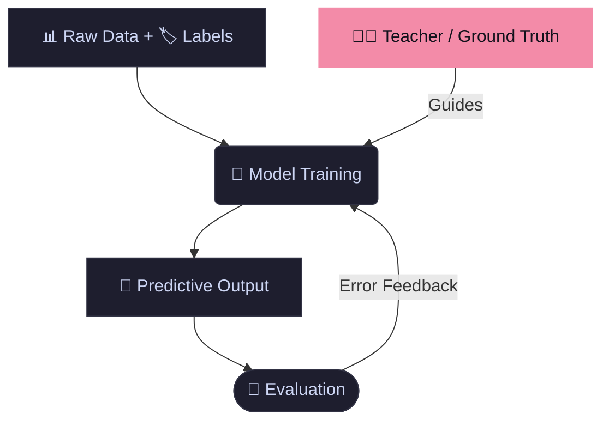
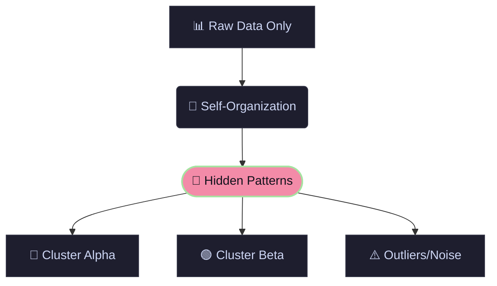

<MathFrame v-if="$slidev.nav.currentPage === $frontmatter.id" :speed="0.003" :thickness="100" baseColor="#00ffff" />

# Clustering Methods
 *by*   
Harsh Jinger
## Demo @ PIBM

  Let's Begin <carbon:arrow-right />

---
layout: center
class: text-center
id: 2
---

<MathFrame v-if="$slidev.nav.currentPage === $frontmatter.id" :speed="0.003" :thickness="60" baseColor="#00ffff" />
# The Business Problem

<v-click>
  

    <h2 class="text-3xl font-semibold text-emerald-400 leading-relaxed">
      "How do we effectively cluster data about customers, logistics, sales, etc. effectively into categories that make sense to think about?"
    </h2>
  

</v-click>

---
layout: center
class: text-center
id: 3
---

<MathFrame v-if="$slidev.nav.currentPage === $frontmatter.id" :speed="0.003" :thickness="60" baseColor="#00ffff" />
# Data Showcase

  <table class="w-full text-left border-collapse">
    <thead class="bg-gray-800 border-b border-gray-700">
      <tr>
        <th class="p-4 font-mono font-bold text-emerald-400">CustomerID</th>
        <th class="p-4 font-mono font-bold text-emerald-400 text-right">Recency (Days)</th>
        <th class="p-4 font-mono font-bold text-emerald-400 text-right">Frequency (Orders)</th>
        <th class="p-4 font-mono font-bold text-emerald-400 text-right">Monetary Value ($)</th>
      </tr>
    </thead>
    <tbody class="divide-y divide-gray-800/60 text-base text-gray-300">
      <tr>
        <td class="p-4 font-mono">#14920</td>
        <td class="p-4 font-mono text-right">3</td>
        <td class="p-4 font-mono text-right">82</td>
        <td class="p-4 font-mono text-right">14,250.00</td>
      </tr>
      <tr class="bg-gray-800/10">
        <td class="p-4 font-mono">#12844</td>
        <td class="p-4 font-mono text-right">12</td>
        <td class="p-4 font-mono text-right">4</td>
        <td class="p-4 font-mono text-right">120.50</td>
      </tr>
      <tr>
        <td class="p-4 font-mono">#17391</td>
        <td class="p-4 font-mono text-right">241</td>
        <td class="p-4 font-mono text-right">1</td>
        <td class="p-4 font-mono text-right">2,100.00</td>
      </tr>
      <tr class="bg-gray-800/10">
        <td class="p-4 font-mono">#15002</td>
        <td class="p-4 font-mono text-right">45</td>
        <td class="p-4 font-mono text-right">18</td>
        <td class="p-4 font-mono text-right">890.00</td>
      </tr>
      <tr>
        <td class="p-4 font-mono">#16211</td>
        <td class="p-4 font-mono text-right">6</td>
        <td class="p-4 font-mono text-right">2</td>
        <td class="p-4 font-mono text-right">45.00</td>
      </tr>
      <tr class="bg-gray-800/10">
        <td class="p-4 font-mono">#19022</td>
        <td class="p-4 font-mono text-right">312</td>
        <td class="p-4 font-mono text-right">1</td>
        <td class="p-4 font-mono text-right">15.00</td>
      </tr>
    </tbody>
  </table>

---
id: 4
layout: center
class: text-center
---

<MathFrame v-if="$slidev.nav.currentPage === $frontmatter.id" :speed="0.003" :thickness="60" baseColor="#00ffff" />
# Machine Learning Approaches: Supervised Learning

---
id: 5
layout: center
class: text-center
---

<MathFrame v-if="$slidev.nav.currentPage === $frontmatter.id" :speed="0.003" :thickness="60" baseColor="#00ffff" />
# Machine Learning Approaches: Unsupervised Learning

---
layout: center
class: text-center
id: 6
---

<MathFrame v-if="$slidev.nav.currentPage === $frontmatter.id" :speed="0.003" :thickness="60" baseColor="#00ffff" />
# Centroid Based Partitioning: K-Means

<PlotlyFigure
  src="kmeans.json"
  caption=""
  width="100%"
  height="320px"
  :fontSize="12"
/>

---
layout: two-cols-header
id: 7
---

<MathFrame v-if="$slidev.nav.currentPage === $frontmatter.id" :speed="0.003" :thickness="60" baseColor="#00ffff" />
# Properties of K-Means Clustering

::left::
* **High-Speed Operational Efficiency**  
  Incredibly fast and computationally cheap. It scales effortlessly across massive datasets, making it the go-to tool for fast, baseline market exploration.
* **Actionable Corporate Boundaries**  
  Creates clean, non-overlapping customer portfolios. Because every customer is assigned to exactly one group, it is simple for marketing teams to execute targeted campaigns.
* **Clear Baseline Metrics**  
  Uses standard averages to define the "typical consumer" profile for each group, providing a clear benchmark for product managers.

::right::

# Commercial Blindspots
Where the Business Logic Fails

* **Forced Consumer Profiling**  
  Operates on "hard assignment." If a customer sits right on the fence between two segments, K-Means forces them into one, completely masking their mixed behavior.
* **Vulnerability to Extreme Outliers**  
  Because it relies strictly on averages, a few ultra-high-spend "whales" or system glitches will violently skew the profile of an entire segment.
* **The Static Scale Challenge**  
  The algorithm cannot organically discover how many segments exist. The management team must predefine the number of groups ($K$), requiring manual validation.

---
layout: center
class: text-center
id: 8
---

<MathFrame v-if="$slidev.nav.currentPage === $frontmatter.id" :speed="0.003" :thickness="60" baseColor="#00ffff" />
# Centroid Based Partitioning: K-Means

<PlotlyFigure
  src="kmeans2.json"
  caption=""
  width="100%"
  height="320px"
  :fontSize="12"
/>

---
layout: center
class: text-center
id: 9
---

<MathFrame v-if="$slidev.nav.currentPage === $frontmatter.id" :speed="0.003" :thickness="60" baseColor="#00ffff" />
# Heirarchy Based Partitioning: Dendrograms

<PlotlyFigure
  src="dendrogram.json"
  caption=""
  width="100%"
  height="320px"
  :fontSize="12"
/>

---
layout: center
class: text-center
id: 10
---

<MathFrame v-if="$slidev.nav.currentPage === $frontmatter.id" :speed="0.003" :thickness="60" baseColor="#00ffff" />
# Probability Based Partitioning: GMM 

<PlotlyFigure
  src="gmm.json"
  caption=""
  width="100%"
  height="320px"
  :fontSize="12"
/>

---
layout: center
class: text-center
id: 11
---

<MathFrame v-if="$slidev.nav.currentPage === $frontmatter.id" :speed="0.003" :thickness="60" baseColor="#00ffff" />
# Density Based Partitioning: DBSCAN

<PlotlyFigure
  src="dbscan.json"
  caption=""
  width="100%"
  height="320px"
  :fontSize="12"
/>

---
layout: center
class: text-center
id: 12
---

<MathFrame v-if="$slidev.nav.currentPage === $frontmatter.id" :speed="0.003" :thickness="100" baseColor="#00ffff" />

# Thank You
 *Presented by*   
Harsh Jinger

## Clustering Methods

  End of Presentation

